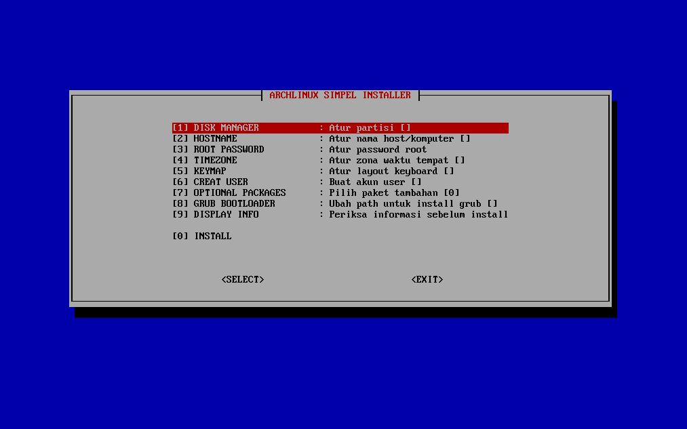
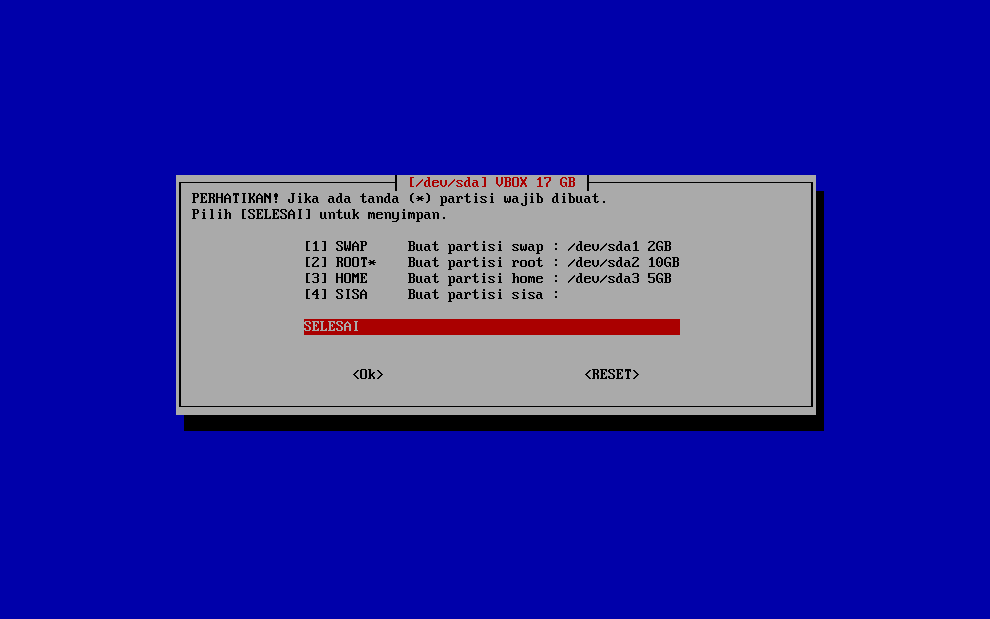
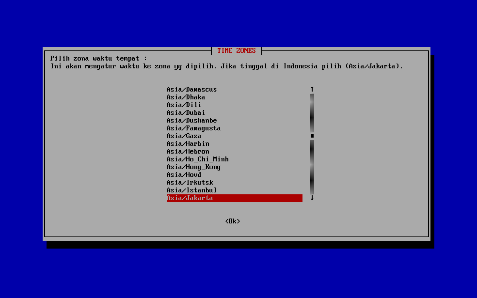
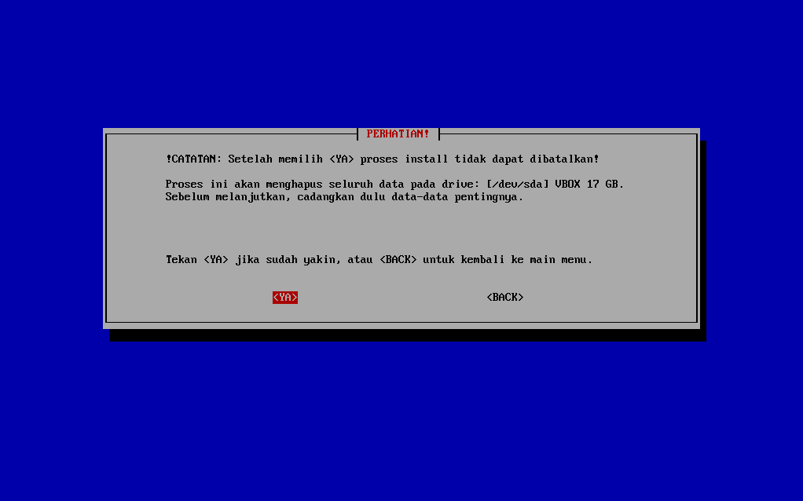

# Simpel script installer arch linux dengan dialog box






>**Install**

```bash
pacman -Sy && pacman -S git
```

```bash
git clone https://github.com/matobodol/arch-simpel.git
```

```bash
cd arch-simpel
```

```bash
chmod +x *.sh
```

```bash
./install.sh
```

Setelah sukses install, reboot system kemudian login dan aktifkan networkmanager dengan perintah:
```bash
  systemctl enable NetworkManager
  systemctl start NetworkManager
```
